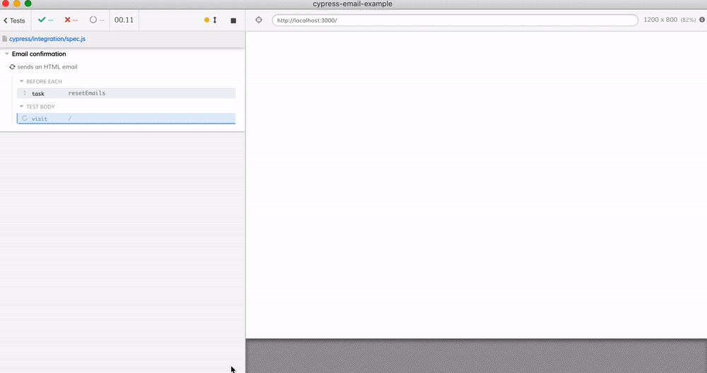

# cypress-email-example
[![ci status][ci image]][ci url] [![badges status][badges image]][badges url] [![renovate-app badge][renovate-badge]][renovate-app]  [](https://dashboard.cypress.io/projects/9gzopg/runs)

Sending emails using [nodemailer](https://nodemailer.com/about/), receive the using [smtp-tester](https://github.com/deitch/smtp-tester) and testing the received email using [Cypress](https://github.com/cypress-io/cypress).



See [cypress/integration/spec.js](./cypress/integration/spec.js)

Read the blog post [Testing HTML Emails using Cypress](https://www.cypress.io/blog/2021/05/11/testing-html-emails-using-cypress/) and watch [this video](https://youtu.be/16WTH7XeIVw) where I explain the entire testing process.

## Install and run

```shell
$ npm install
$ npm start
# from another terminal
$ npx cypress open
# click the spec.js
```

## The application

The application shows the registration page [pages/index.js](./pages/index.js) where the user can fill the email and click the submit button. The page makes an Ajax request to the [pages/api/register.js](./pages/api/register.js) handler which sends an email. The email has the confirmation code the user is expected to enter on the confirmation page [pages/confirm.js](./pages/confirm.js).

## Email server

The emails are sent using [nodemailer](https://nodemailer.com/about/), see [emailer.js](./emailer.js). During tests the SMTP server is running inside [cypress/plugins/index.js](./cypress/plugins/index.js) process.

## Cypress tests

- [cypress/integration/spec.js](./cypress/integration/spec.js) shows the full plain and HTML email test
- [cypress/integration/confirm-spec.js](./cypress/integration/confirm-spec.js) runs E2E tests for the confirmation page in isolation
- [cypress/integration/check-email-spec.js](./cypress/integration/check-email-spec.js) is an API test that calls the [pages/api/register.js](./pages/api/register.js) handler and confirms the handler sends an email

The tests run on GitHub Actions, see the [.github/workflows/ci.yml](./.github/workflows/ci.yml) workflow. The results are recorded on [Cypress Dashboard](https://dashboard.cypress.io/projects/9gzopg/runs).

[ci image]: https://github.com/bahmutov/cypress-email-example/workflows/ci/badge.svg?branch=main
[ci url]: https://github.com/bahmutov/cypress-email-example/actions
[badges image]: https://github.com/bahmutov/cypress-email-example/workflows/badges/badge.svg?branch=main
[badges url]: https://github.com/bahmutov/cypress-email-example/actions
[renovate-badge]: https://img.shields.io/badge/renovate-app-blue.svg
[renovate-app]: https://renovateapp.com/
